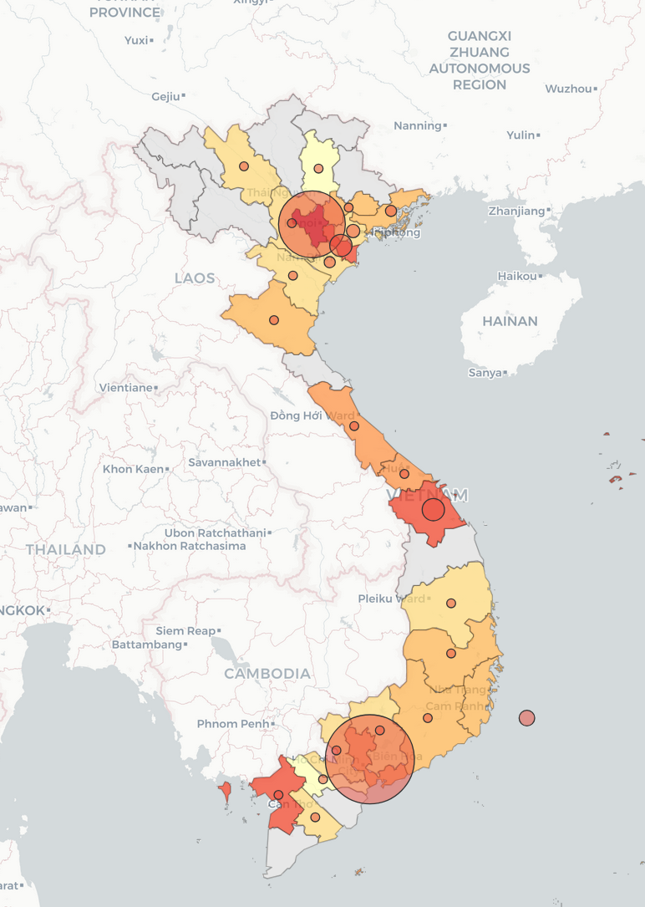

# batdongsan.com.vn Apartment Data



Crawl, clean, and analyze apartment listing data from [batdongsan.com.vn](https://batdongsan.com.vn/ban-can-ho-chung-cu).

Uses headless Chrome via Playwright with stealth to bypass bot detection. Supports parallel workers for fast crawling.

## Extracted fields

| Field | Example |
|-------|---------|
| `product_id` | `45179819` |
| `title` | `Căn hộ 2PN Vinhomes Grand Park` |
| `price_text` | `4,68 tỷ` |
| `area_text` | `71 m²` |
| `price_per_m2_text` | `65,92 tr/m²` |
| `bedrooms` | `2` |
| `bathrooms` | `2` |
| `location` | `Hồ Chí Minh` |
| `description` | Full listing description text |
| `post_date` | `15/03/2026` |
| `contact_name` | `Nguyễn Văn A` |
| `url` | Full listing URL |
| `page_num` | `1` |

## Setup

```bash
pip install -r requirements.txt
python -m playwright install chromium
```

## Usage

```bash
# Crawl pages 1-50 with 4 workers (default)
python crawl.py

# Crawl all ~2184 pages with 8 workers
python crawl.py --pages 1 2184 --workers 8

# Custom output file
python crawl.py --pages 1 100 --output data.csv

# Run in background
nohup python crawl.py --pages 1 2184 --workers 8 --output apartments.csv > crawl.log 2>&1 &
tail -f crawl.log
```

## How it works

1. Page range is split evenly across workers
2. Each worker launches its own headless Chrome and crawls its assigned pages
3. A fresh browser context is created per page to avoid bot detection
4. Browser is restarted every 20 pages to prevent memory leaks
5. Each worker writes results to its own `.tmp` CSV file (crash-safe)
6. After all workers finish, `.tmp` files are merged, deduplicated, and sorted into the final CSV

## Data cleaning

```bash
python clean.py
```

Produces `apartments_cleaned.csv` and `apartments.db` (SQLite) with:

- **Parsed numeric columns**: `price_billion` (tỷ), `area_m2`, `price_per_m2_million` (triệu/m²)
- **Missing value handling**: drops empty titles, converts bedrooms/bathrooms to nullable ints
- **Standardized locations**: strips "(... mới)" suffixes, maps to Vietnam's 34 provinces (2025 reform)

## Analysis

Query the SQLite database with [litecli](https://litecli.com/):

```bash
pip install litecli
litecli apartments.db
```

```sql
-- Median price per m² by province
WITH ranked AS (
    SELECT location, price_per_m2_million,
           ROW_NUMBER() OVER (PARTITION BY location ORDER BY price_per_m2_million) as rn,
           COUNT(*) OVER (PARTITION BY location) as cnt
    FROM apartments WHERE price_per_m2_million IS NOT NULL
)
SELECT location, cnt, ROUND(AVG(price_per_m2_million), 1) as median_price
FROM ranked WHERE rn IN (cnt/2, cnt/2 + 1)
GROUP BY location ORDER BY median_price DESC;
```

## Heatmap

Generate a choropleth map of Vietnam (new 34-province boundaries) with median price/m² and listing volume:

```bash
pip install geopandas folium
python heatmap.py
# Open heatmap.html in browser
```

Color = median price per m², bubble size = number of listings.

## Notes

- Each page has ~20 listings. The site currently has ~43,000 total listings (~2184 pages).
- Price values are in Vietnamese format (`4,68 tỷ` = 4.68 billion VND, `65,92 tr/m²` = 65.92 million VND/m²).
- Workers: 4-8 is safe. Higher counts are faster but risk getting blocked. Memory usage is ~150MB per worker (Chromium).
- If the crawl is interrupted, `.tmp` files preserve all progress. Just restart — stale `.tmp` files are cleaned up automatically before a new run.
